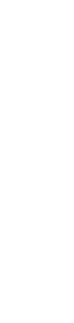

<table>
<tr>
<td width="160">

</td>

<td>

## Bio
- Ex nihilo nihil fit, Audentes fortuna iuvat.
- I believe small improvements made consistently lead to meaningful results.
- There is no magic, just abstraction layers built on top of one another.

---

## GitHub Stats

---

## Goals

- Contribute to the future of biological computing
- Build projects that help people work more effectively
- Share knowledge through writing and teaching
- Keep learning, creating, and enjoying the journey

</td>
</tr>
</table>
